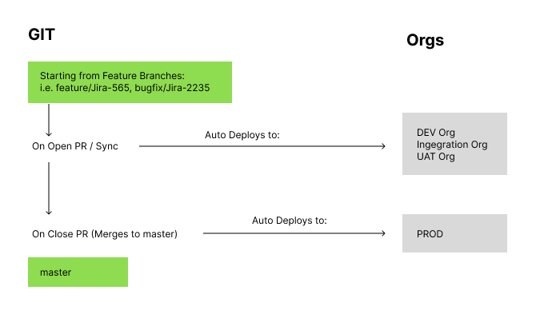

# Simple CICD for Salesforce using GH Actions

All Salesforce code in this repo are "test" code. The purpose of this repo is to demonstrate the capabilities of the YAML files inside the .github/workflows folder. 

More information can be found here: https://michaelsoriano.com/simple-cicd-for-salesforce-using-sfdx-and-github-actions/

## Steps

- Starting from a feature branch "Jira branch", all commits and pushes will store it in this branch
- When code is ready, open a Pull Request (curbranch to development) - this will push it to the org(s): scdev4, int2, uat
- If all is good, "Approve/Merge" the PR - this will push it to the production org

## Branches:

- By default, each repository will have the following branches:
    - feature branches aka (feature/jira-4553, bugfix/jira-5656)
    - master (pushed to prod)

## Features:

- Using this development model has the following advantages:

### Will only deploy the changed meta data

- You don't need to select the metadata you want to deploy. GH Actions automatically detect the changes in the repo.
- We are `sfdx-git-delta` to only deploy the metadata that has been changed (or created) by the developer. 
- This will include all changes that are done in the org through the SF UI - as long as its part of package.xml
- This is created during deployment in an ignored folder called `changed-sources`; 

### No need to specify tests classes

- A script will automatically detect all the test classes in your repo. This will run by default.
- Although you can also specify which tests to run by using a special syntax in the pull request body:

`Apex::[Class1,Class2,Class3...]::Apex`

### Static code analysis - NOT IMPLEMENTED YET

- We are using the `sfdx scanner` to scan the code in the delta directory. 

### All interactions done through Pull Requests

- All workflows are triggered by changes in the Pull Requests. Note that PR's is the intermediary step before merging to another branch
- This adds an extra layer of approval / review before merging
- All done in as part of the repository
- Tracking and History is kept along with the repository

## Extras

### To Get Auth Keys:

- Run this in cli to get authFile.json, which has sfdxAuthUrl inside. replace <ORGUSERNAME> with your username

`sfdx force:org:display -u <ORGUSERNAME> --verbose --json > auth/<ORGNAME>.json`

### 3 ORG KEYS: 

- `SFDX_DEVELOPMENT_URL`
- `SFDX_STAGING_URL`
- `SFDX_PRODUCTION_URL` 